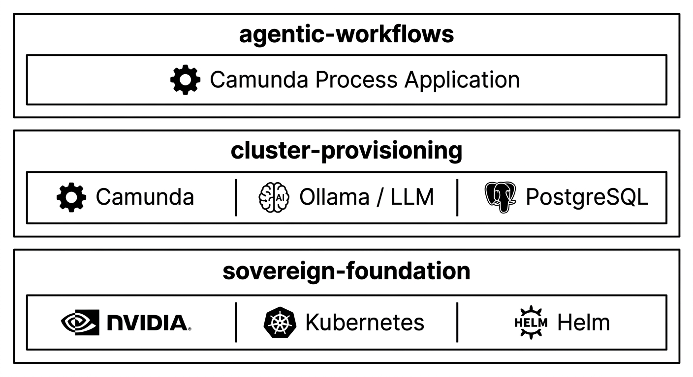

# Sovereign Camunda Agent Lab 🚀

<p align="center">
  
  
</p>

## ⚡ Summary

* Lightweight, ephemeral DevOps lab for rapidly spinning up a Camunda 8 Agentic AI process application together with an LLM provider on Jetson Orin Nano. 
* Designed to run and observe workflows like provisioning and scaling on Kubernetes or optimizing Agentic AI Tool Calls.
* Monorepo built on core enterprise patterns, including NVIDIA GPU Acceleration, Self-Managed Camunda, local LLMs, Provisioning, Air-gapped Data Sovereignty, and Agentic AI Observability.
* Designed for the NVIDIA Jetson Orin Nano (Debian-based edge device), assuming a dedicated device that can be easily wiped and reprovisioned.

**Table of Contents**
* [⚡ Summary](#-summary)
* [🚀 Roadmap & Phases](#-roadmap--phases)
* [⚠️ Known Limitations & Architectural Caveats](#%EF%B8%8F-known-limitations--architectural-caveats)
* [📋 Prerequisites](#-prerequisites)
* [🏗 Sovereign Foundation](#-sovereign-foundation)
* [♾️ Cluster Provisioning](#cluster-provisioning)
* [⚙️ Agentic Workflows](#agentic-workflows)

---

### 🚀 Roadmap & Phases

- **Sovereign Foundation:** under test
- **Cluster Provisioning:** under development
- **Agentic Workflows Process:** planned

---

### ⚠️ Known Limitations & Architectural Caveats

While this Lab serves as a rapid local DevOps lab for the enterprise patterns listed above, certain other enterprise patterns are currently simplified:

* **Host-Level Bootstrapping:** Installation scripts currently modify host configurations directly (e.g., Docker daemon, CNI).
* **Enterprise Limitations:** No GitOps (only Helm), No Prometheus/Grafana (only simple statistics planned). 
* **Resource Constraints (Edge):** Camunda 8 together with local LLMs requires significant memory. Edge profile requires aggressive resource tuning to avoid OOM issues.

---

## 📋 Prerequisites
- **OS:** Debian-based Linux with NVIDIA Drivers & CUDA Toolkit installed (can be verified by running `nvidia-smi`).
- **Package Manager:** `apt` is available.
- **Basic Tools:** `curl`, `git`, `gpg`, `sed` are installed.
- **Kubernetes Tools:** `kubectl` is installed and available in your PATH.
- **Connectivity:** Internet access is required during the bootstrap process.
- **Repository:** You cloned the repo:
```bash
git clone https://github.com/kj-hilger/sovereign-camunda-agent-lab.git
```

---

## 🏗 Sovereign Foundation

Scripts to install tools for NVIDIA GPU Acceleration, K8s and Helm.

### Bootstrap

```bash
chmod +x ./sovereign-foundation/install.sh
./sovereign-foundation/install.sh
```

#### Detailed documentation

| Step | Description                                                                | Key Challenges                                                                                                                                                                                        |
|------|----------------------------------------------------------------------------|-------------------------------------------------------------------------------------------------------------------------------------------------------------------------------------------------------|
| 1    | Boot Configuration & Cgroups Check                                         | Missing cgroup parameters cause memory crashes; requires reboot.                                                                                                                                      |
| 2    | Pre-Installation Checks                                                    | Verify Jetson hardware presence. **⚠Overwrites /opt/cni/bin/ ⚠**                                                                                                                                    |
| 3    | Installing NVIDIA Container Runtime & Network Config (containerd, flannel) | CRI unblocking and preconfiguring CNI for a stable network; aligning container runtimes with system‑wide containerd + NVIDIA runtime. **⚠fix versions for cni-plugins v1.4.0 and flannel v1.9.0 ⚠** |
| 4    | Installing K3s                                                             | None specific; standard K3s install using containerd endpoint.                                                                                                                                        |
| 6    | Enabling NVIDIA GPU Support in Kubernetes                                  | The Kubernetes resources for NVIDIA Device Plugin fail on Jetson due to PCI‑based affinity and memory management issues, thus patches and enhancements are needed.                                    |
| 7    | Resource Optimization                                                      | Minimizing log overhead and saving unified memory.                                                                                                                                                    |

### Post-Installation
* The installation configures Docker to run without `sudo` for the current user.
* Run check script:
```bash
chmod +x ./sovereign-foundation/check.sh
./sovereign-foundation/check.sh
```
* Docker and NVIDIA Toolkit will be updated via apt Package Manager.

### Start again after reboot
* K3s starts automatically via systemd service.

### Delete All and Reinstall (with latest software versions)

```bash
chmod +x ./sovereign-foundation/k3s-uninstall.sh  # **⚠️ deletes all content under /var/lib/docker ⚠️**
./sovereign-foundation/k3s-uninstall.sh

# reboot

# run bootstrap script again
```

---

## ♾️Cluster Provisioning

* Manifest Helm-Charts and scripts to install Camunda 8 (including Camunda Agentic AI Connector, PostgreSQL) and Ollama (including local LLM) self-managed on top of the Sovereign Foundation layer. 
* You have air-gapped Data Sovereignty at runtime.

### Bootstrap

```bash
chmod +x ./cluster-provisioning/bootstrap.sh
./cluster-provisioning/bootstrap.sh
```

#### Detailed documentation

| Step  | Component                        | Action & Structural Rationale                                                                                                          |
|:------|:---------------------------------|:---------------------------------------------------------------------------------------------------------------------------------------|
| **1** | **Detecting project path**       |                                                                                                                                        |
| **2** | **Adding Helm repositories**     |                                                                                                                                        |
| **3** | **Updating Helm dependencies**   | This downloads the official charts and places them as archives in the automatically created folders within each application structure. |
| **4** | **Creating Namespaces**          |                                                                                                                                        |
| **5** | **Setting up PostgreSQL secret** | Prompts for password of your choice.                                                                                                   |
| **6** | **Helm Deployment**              |                                                                                                                                        |


### Post-Installation

* Because all dependencies are provisioned locally, the system requires no external communication with Helm repositories. 
* To perform changes in the configuration, modify the values.yaml files and execute uninstall and bootstrap again.


### Delete All

```bash
chmod +x ./cluster-provisioning/uninstall.sh
./cluster-provisioning/uninstall.sh
```

---

## ⚙️Agentic Workflows

* Leverages Camunda 8 Deterministic Orchestration to manage agentic decision flows, ensuring full process visibility, execution logging and Observability. 
* The BPMN Pattern Agentic AI as Subprocess together with a human task ensures "Human-in-the-Loop".

### Bootstrap

```
# planned Process Name: Agentic Orchestrator
```

### Run instances

```
# planned: Link to Operate
```

### Observe Audit Trail
*   **Prompt & Response:** Full visibility into the exact instructions and raw LLM outputs.
*   **Reasoning Path:** Exposure of intermediate "Chain of Thought" (CoT) and logic steps.
*   **Tool Calls:** Precise logging of which internal/external tools or APIs the agent invoked.
*   **Memory Context:** A snapshot of short-term and long-term memory state at the moment of decision.

---

## 📄Docs

- Architectural diagrams
- Architectural decisions
- Pictures

---

## 📄 License

This project is licensed under the MIT License - see the [LICENSE](LICENSE) file for details.
